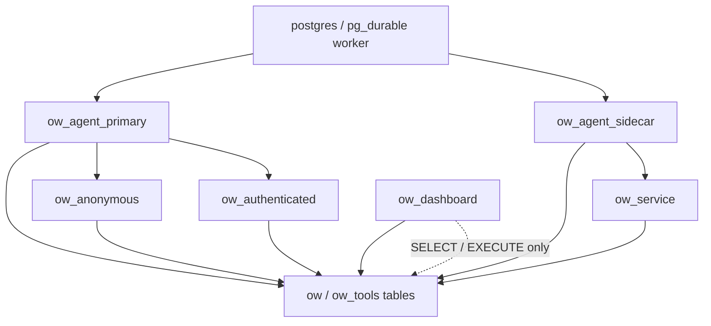

# OpenWorld

OpenWorld is a Postgres-resident agent harness built for shared, stateful
conversations. It is designed for multiplayer agents that join group chats and
respond safely to unknown numbers by keeping the conversation stream, user
identity ledger, and access boundaries inside PostgreSQL.

All agent loops run as `pg_durable` workflows, so a turn can survive database
restarts and resume from its last checkpoint. Every turn, tool call, and inbox
update is recorded as a workflow instance and message rows, available for replay
and debugging.

See [docs/ARCHITECTURE.md](docs/ARCHITECTURE.md) for details on the design
philosophy, execution model, and access permission matrix.

## Getting started

Copy the example environment file, adjust any values you need, and start the
stack:

```bash
cp .example.env .env
docker compose up -d
```

Detailed configuration, seeding, Telegram, and dashboard setup lives in
[docs/CONFIGURATION.md](docs/CONFIGURATION.md).

## Tables

- `ow.agents`: one row per agent.
- `ow.models`: reusable model, endpoint, temperature, reasoning, context, and modality configuration.
- `ow.config`: per-agent configuration and secrets.
- `ow.messages`: canonical conversation stream — user, assistant, system,
  and tool rows. Outbound delivery is trigger-driven off this table, so there is
  no separate outbox.
- `ow.memory`: agent-scoped durable memories forwarded to the LLM. Each row
  links to the messages it was constructed from via `ow.memory_sources`.
- `ow.memory_sources`: junction table backing memory's source messages;
  composite foreign keys force same-agent integrity and cascade on delete.
- `ow.users`: channel-agnostic identity ledger. One row per
  `(channel, external_id)`; telegram intake (`poll_messages` → `upsert_user`)
  upserts senders, and `tier` maps a user to an RLS role suffix
  (`anonymous` / `authenticated`).

## Roles

The permission model is split into a few small roles rather than one broad
application role:

- `ow_agent_primary` runs the primary loop and handles user-facing turns.
- `ow_agent_sidecar` runs review and background loops.
- `ow_anonymous` and `ow_authenticated` are user-scoped SQL tiers for
  the primary agent's tool calls.
- `ow_service` is the sidecar agent's broader tool-call scope.
- `ow_dashboard` is read-only for the admin dashboard.

`pg_durable` executes the loop as the agent role, then drops into a narrower
role when the SQL tool runs. The dashboard connects with a separate read-only
principal. Full policy details live in [docs/ARCHITECTURE.md](docs/ARCHITECTURE.md).



## Built-In Tools

The LLM sees these database-native tools (schemas are introsducted from the
`ow_tools._tool_*` functions):

- `SEARCH`: search the public web and return titles, URLs, and snippets.
- `WEBFETCH`: fetch a public HTTP(S) URL and return status, content type, and a truncated text body.
- `BASH`: run a shell command on a registered remote host over SSH. `host` is optional and defaults to the first registered host when omitted.
- `SEND_PHOTO` / `SEND_VIDEO` / `SEND_AUDIO`: send a photo / video / audio as a
  Telegram attachment derived from an HLS playlist. First create the playlist
  with `SELECT ffmpeg.hls(url, segment_duration)` (SQL tool), then pass the
  returned `playlist_id` here along with an ffmpeg `transform` (e.g.
  `thumbnail`, `transcode`, `trim`, `extract_audio`) and an `options` object.
  Media bytes are produced server-side and never enter the model context.
- `SEND_ATTACHMENT`: send media (image/audio/video) you already hold as inline
  bytes (base64/hex + encoding) as a Telegram attachment; kind is auto-detected.
- `SQL`: run a single SQL query that returns rows.

`BASH` uses the `pg_ssh` extension's `ssh.exec(host_name, command)` function.
That function returns `stdout` and `stderr` as `bytea` and is defined as
`SECURITY DEFINER`, owned by `postgres`. By default `EXECUTE` is granted to
`PUBLIC`, so the acting role can call it without extra grants and never sees
the SSH keys. To restrict remote command execution, revoke `EXECUTE` from
`PUBLIC` and grant it only to the roles you want to allow.

See [docs/CONFIGURATION.md](docs/CONFIGURATION.md) for SSH host registration.

## Admin Dashboard


