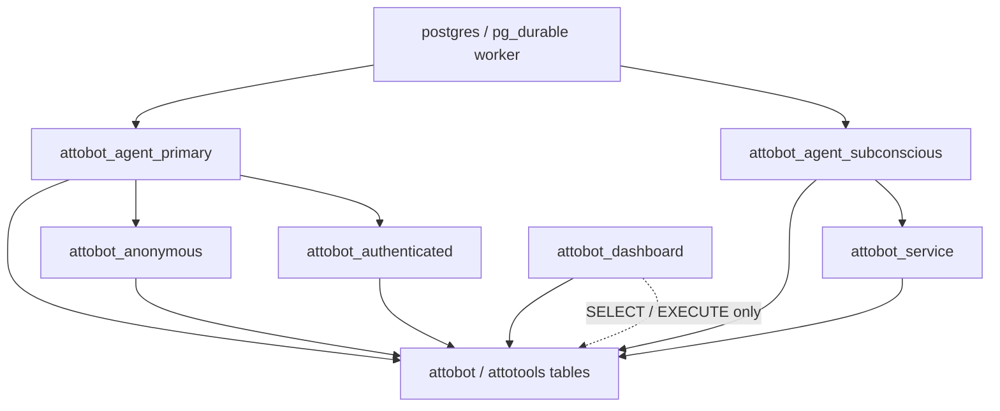

# attobot

attobot is a Postgres-resident agent harness built for shared, stateful
conversations. It is designed for multiplayer agents that join group chats and
respond safely to unknown numbers by keeping the conversation stream, user
identity ledger, and access boundaries inside PostgreSQL.

All agent loops run as `pg_durable` workflows, so a turn can survive database
restarts and resume from its last checkpoint. The full lifecycle is captured as
events in the database, so every turn, tool call, inbox update, and operational
change is available for auditing, replay, and debugging.

See [docs/ARCHITECTURE.md](docs/ARCHITECTURE.md) for details on the design
philosophy, execution model, and access permission matrix.

## Getting started

Copy the example environment file, adjust any values you need, and start the
stack:

```bash
cp .example.env .env
docker compose up -d
```

Detailed configuration, seeding, Telegram, and dashboard setup lives in
[docs/CONFIGURATION.md](docs/CONFIGURATION.md).

## Tables

- `attobot.agents`: one row per agent.
- `attobot.models`: reusable model, endpoint, temperature, reasoning, context, and modality configuration.
- `attobot.config`: per-agent configuration and secrets.
- `attobot.messages`: canonical conversation stream — user, assistant, system,
  and tool rows. Outbound delivery is trigger-driven off this table, so there is
  no separate outbox.
- `attobot.memory`: agent-scoped durable memories forwarded to the LLM. Each row
  links to the messages it was constructed from via `attobot.memory_sources`.
- `attobot.memory_sources`: junction table backing memory's source messages;
  composite foreign keys force same-agent integrity and cascade on delete.
- `attobot.lifecycle`: append-only audit log of operational events (agent
  ensure, message appends, telegram poll/send outcomes, security markers).
- `attobot.users`: channel-agnostic identity ledger. One row per
  `(channel, external_id)`; telegram intake (`poll_messages` → `upsert_user`)
  upserts senders, and `tier` maps a user to an RLS role suffix
  (`anonymous` / `authenticated`).
- `attotools.blobs`: content-addressed large content storage as external `bytea`.

## Roles

The permission model is split into a few small roles rather than one broad
application role:

- `attobot_agent_primary` runs the primary loop and handles user-facing turns.
- `attobot_agent_subconscious` runs review and background loops.
- `attobot_anonymous` and `attobot_authenticated` are user-scoped SQL tiers for
  the primary agent's tool calls.
- `attobot_service` is the subconscious agent's broader tool-call scope.
- `attobot_dashboard` is read-only for the admin dashboard.

`pg_durable` executes the loop as the agent role, then drops into a narrower
role when the SQL tool runs. The dashboard connects with a separate read-only
principal. Full policy details live in [docs/ARCHITECTURE.md](docs/ARCHITECTURE.md).



## Built-In Tools

The LLM sees these database-native tools (schemas are introsducted from the
`attotools._tool_*` functions):

- `SEARCH`: search the public web and return result titles, URLs, and snippets.
- `WEBFETCH`: fetch a public HTTP(S) URL and return status, content type, effective URL, and a truncated text body.
- `SQL`: run a single SQL query that returns rows.
- `SEND_ATTACHMENT`: send a stored blob as a Telegram document attachment.
- `WRITE_BLOB`: write large or binary content into `attotools.blobs` using an explicit encoding.
- `READ_BLOB`: read blob content by hash as `UTF8` text, `base64`, `hex`, `escape`, or another PostgreSQL text encoding.
- `SQL` intentionally accepts only one semicolon-free query and wraps it as a
subquery. For writes, use a data-modifying CTE with `RETURNING`, for example:

```sql
WITH ins AS (
  INSERT INTO some_table(value) VALUES ('x')
  RETURNING *
)
SELECT * FROM ins
```
